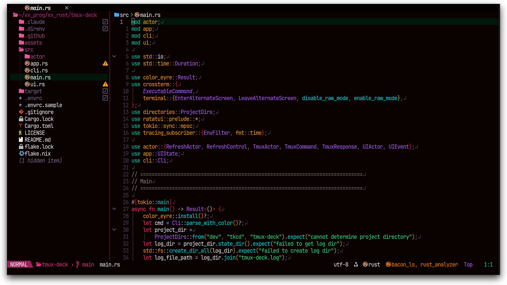
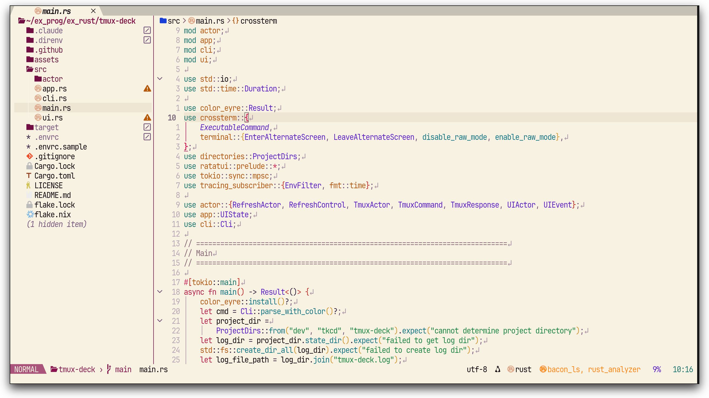

# plum.nvim

A high-contrast Neovim colorscheme inspired by the vivid colors of the **Japanese plum (すもも)** — the pink-red skin, orange-yellow flesh, and vivid green leaves.

<div align="center">
  <h3>plum-dark</h3>
  <h3>plum-light</h3>
</div>

## Requirements

- Neovim 0.9+
- `termguicolors` enabled

## Installation

### lazy.nvim

```lua
{
    "takeshid/plum.nvim",
    lazy = false,
    priority = 1000,
    config = function()
        require("plum").setup({
            variant = "dark"
        })
        vim.cmd("colorscheme plum")
    end,
}
```

### vim-plug

```vim
Plug 'takeshid/plum.nvim'
colorscheme plum
```

## Configuration

Call `setup()` before applying the colorscheme. All options are optional.

```lua
require("plum").setup({
    -- Style
    variant = "auto", -- default "auto", selectable: "dark" / "light"
    -- Replace bg with "NONE" for transparent backgrounds
    transparent = false,

    -- Desaturate all colors (0.0 = grayscale, 1.0 = full color)
    saturation = 1,

    -- Apply italic to comments
    italic_comments = false,

    -- Hide window separator fill characters
    hide_fillchars = false,

    -- Borderless style for telescope/fzf pickers
    borderless_pickers = false,

    -- Set terminal colors (vim.g.terminal_color_*)
    terminal_colors = true,

    -- Override individual palette colors
    colors = {
        -- applies to both variants:
        -- pink = "#FF0066",
        -- per-variant overrides:
        -- dark  = { bg = "#000000" },
        -- light = { bg = "#FFFFFF" },
    },

    -- Override specific highlight groups (table or function)
    highlights = {
        -- Comment = { fg = "#999999", italic = true },
    },
    -- or as a function receiving the resolved palette:
    -- overrides = function(t)
    --     return { Comment = { fg = t.fg_subtle } }
    -- end,

    -- Enable/disable plugin integrations
    extensions = {
        telescope      = true,
        gitsigns       = true,
        cmp            = true,
        lazy           = true,
        whichkey       = true,
        noice          = true,
        mini           = true,
        dashboard      = true,
        indentblankline = true,
        notify         = true,
        treesitter     = true,
        neotree        = true,
        -- Disable all extensions except specific ones:
        -- default = false,
        -- telescope = true,
    },
})
```

## Supported plugins

| Plugin | Extension key |
|--------|--------------|
| telescope.nvim | `telescope` |
| gitsigns.nvim | `gitsigns` |
| nvim-cmp | `cmp` |
| lazy.nvim | `lazy` |
| which-key.nvim | `whichkey` |
| noice.nvim | `noice` |
| mini.nvim | `mini` |
| dashboard.nvim / alpha.nvim | `dashboard` |
| indent-blankline.nvim | `indentblankline` |
| nvim-notify | `notify` |
| nvim-treesitter | `treesitter` |
| neo-tree.nvim | `neotree` |

## lualine support

`plum.nvim` also ships `lualine` themes for both variants:

- `plum-dark`
- `plum-light`

```lua
require("lualine").setup({
    options = {
        theme = "auto", -- auto detect colorscheme
    },
})
```

## License

MIT
